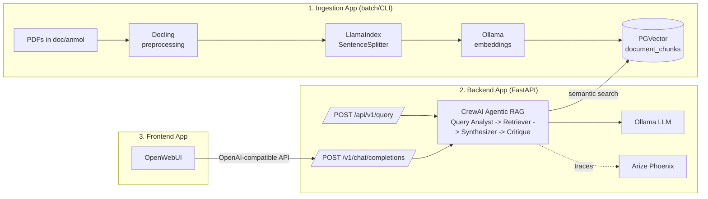
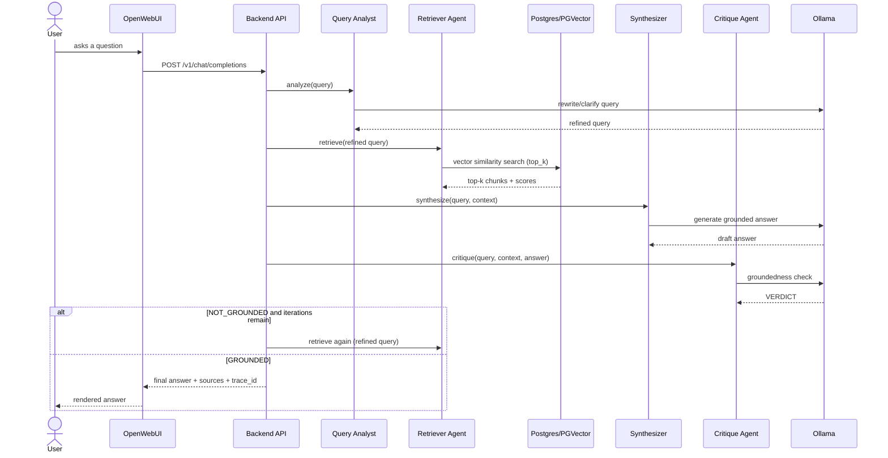
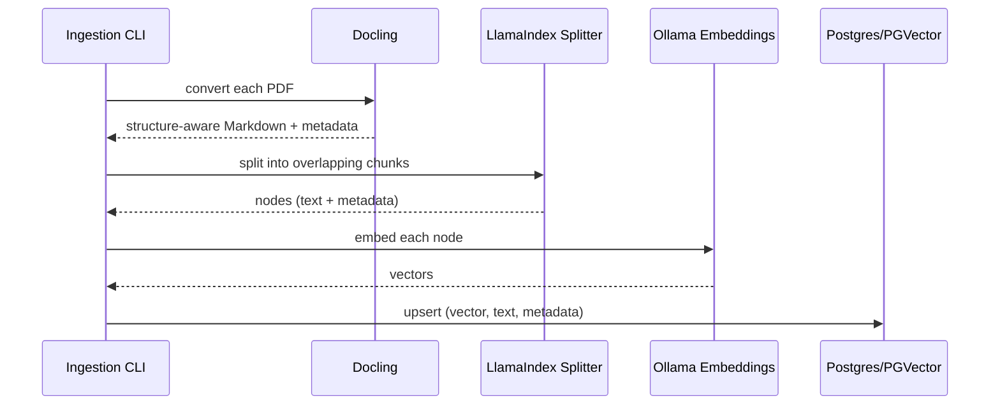

# Solution Architecture — Document Search Platform

## 1. Component overview

Three independently deployable applications share one codebase and one
PostgreSQL/PGVector knowledge base:

## 2. Query-time sequence

## 3. Ingestion-time sequence

## 4. Deployment view

All services run as containers via `docker-compose.yml`:

| Service | Image/Build | Purpose |
|---|---|---|
| `postgres` | `pgvector/pgvector:pg16` | Vector knowledge base |
| `ollama` | `ollama/ollama` | Local LLM + embedding inference |
| `phoenix` | `arizephoenix/phoenix` | Tracing/observability UI + OTLP collector |
| `ingestion` | built from `ingestion/Dockerfile` | One-off job (`profiles: tools`) |
| `backend` | built from `backend/Dockerfile` | FastAPI Agentic RAG API |
| `openwebui` | `ghcr.io/open-webui/open-webui` | Chat frontend |

## 5. Key design decisions

- **Docling over naive PDF text extraction**: preserves headings/tables and
  reading order, which meaningfully improves chunk quality for RAG.
- **PGVector over a dedicated vector DB**: keeps the whole platform on one
  well-understood, easy-to-self-host datastore; HNSW indexing keeps
  retrieval fast at the scale a single-team knowledge base needs.
- **CrewAI sequential agents with a critique loop** rather than a single
  retrieve→generate call: adds a genuine agentic/self-correcting step
  (re-retrieval on a failed groundedness check) while staying easy to trace
  and reason about — each stage is one agent, one task, one LLM call.
- **Prompts externalized as YAML**: satisfies the requirement that prompts
  be manageable independently of application code, and keeps `crew_agents.py`
  free of embedded prompt strings.
- **OpenAI-compatible endpoint for the frontend integration**: avoids
  needing a custom OpenWebUI plugin/pipeline — OpenWebUI treats the backend
  as just another OpenAI-compatible provider.

## 6. Known limitations / next steps

- Ingestion is currently additive; add delete-by-`source_file` before
  re-insert for clean re-ingestion of updated PDFs.
- `/v1/chat/completions` doesn't stream yet (see backend README).
- Per-request `top_k` override is accepted by the API schema but not yet
  wired through to the retriever.
- RAGAs evaluation test set (`doc/eval/testset.json`) ships with placeholder
  ground truths — replace with answers grounded in your real PDFs before
  treating the scores as meaningful.
